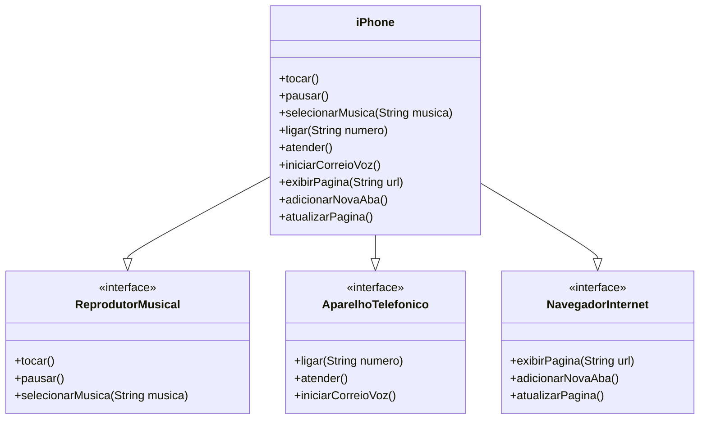

# 📱 Projeto iPhone - DIO - Trilha Java Básico

Este projeto é parte do desafio proposto na Trilha de Java Básico da [DIO](https://www.dio.me/), com o objetivo de praticar conceitos de Programação Orientada a Objetos (POO) através da modelagem e implementação de um componente iPhone com suas funcionalidades principais.

---

## 📚 Funcionalidades Modeladas

O iPhone foi modelado com base em três grandes funcionalidades, cada uma representada por uma interface:

- 🎵 **Reprodutor Musical**
  - `tocar()`
  - `pausar()`
  - `selecionarMusica(String musica)`

- 📞 **Aparelho Telefônico**
  - `ligar(String numero)`
  - `atender()`
  - `iniciarCorreioVoz()`

- 🌐 **Navegador na Internet**
  - `exibirPagina(String url)`
  - `adicionarNovaAba()`
  - `atualizarPagina()`

A classe `iPhone` implementa todas essas interfaces, simulando as funcionalidades principais do dispositivo.

---

## 🧩 Diagrama UML (Mermaid)



---

## 📂 Estrutura de Código

A seguir, a implementação completa das interfaces e da classe `iPhone`, conforme o desafio proposto.

---

```java
public interface ReprodutorMusical {
    void tocar();
    void pausar();
    void selecionarMusica(String musica);
}

public interface AparelhoTelefonico {
    void ligar(String numero);
    void atender();
    void iniciarCorreioVoz();
}

public interface NavegadorInternet {
    void exibirPagina(String url);
    void adicionarNovaAba();
    void atualizarPagina();
}

public class iPhone implements ReprodutorMusical, AparelhoTelefonico, NavegadorInternet {

    // ReprodutorMusical
    public void tocar() {
        System.out.println("Tocando música...");
    }

    public void pausar() {
        System.out.println("Música pausada.");
    }

    public void selecionarMusica(String musica) {
        System.out.println("Selecionando a música: " + musica);
    }

    // AparelhoTelefonico
    public void ligar(String numero) {
        System.out.println("Ligando para: " + numero);
    }

    public void atender() {
        System.out.println("Atendendo chamada...");
    }

    public void iniciarCorreioVoz() {
        System.out.println("Iniciando correio de voz...");
    }

    // NavegadorInternet
    public void exibirPagina(String url) {
        System.out.println("Exibindo página: " + url);
    }

    public void adicionarNovaAba() {
        System.out.println("Nova aba adicionada.");
    }

    public void atualizarPagina() {
        System.out.println("Atualizando a página...");
    }
}

```