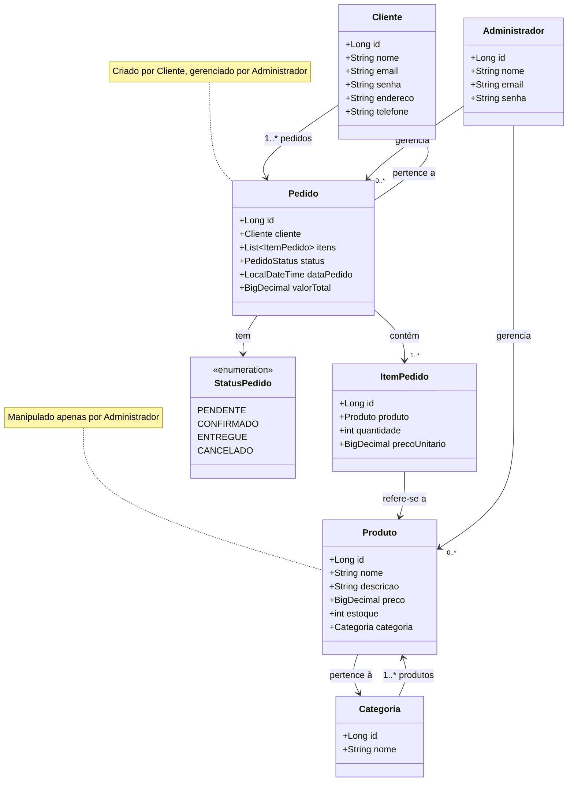

### Diagrama de classes

```mermaid

classDiagram
  class Produto {
    +Long id
    +String nome
    +String descricao
    +BigDecimal preco
    +int estoque
    +Categoria categoria
  }

  class Categoria {
    +Long id
    +String nome
  }

  class Cliente {
    +Long id
    +String nome
    +String email 
    +String senha 
    +String endereco 
    +String telefone
  }

  class Administrador {
    +Long id
    +String nome
    +String email
    +String senha
  }

  class Pedido {
    +Long id
    +Cliente cliente
    +List~ItemPedido~ itens
    +PedidoStatus status
    +LocalDateTime dataPedido
    +BigDecimal valorTotal
  }

  class ItemPedido {
    +Long id
    +Produto produto
    +int quantidade
    +BigDecimal precoUnitario
  }

  class StatusPedido {
    <<enumeration>>
    PENDENTE
    CONFIRMADO
    ENTREGUE
    CANCELADO
  }

  Produto --> Categoria : pertence à
  Categoria --> Produto : 1..* produtos

  Pedido --> Cliente : pertence a
  Cliente --> Pedido : 1..* pedidos

  Pedido --> "1..*" ItemPedido : contém
  ItemPedido --> Produto : refere-se a

  Pedido --> StatusPedido : tem

  note for Produto "Manipulado apenas por Administrador"

  note for Pedido "Criado por Cliente, gerenciado por Administrador"

  Administrador --> "0..*" Produto : gerencia
  Administrador --> "0..*" Pedido : gerencia

```