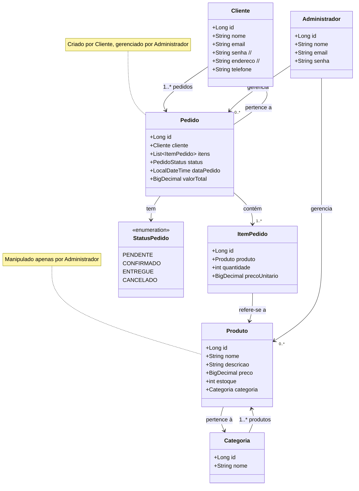

# 🛒 VendasApi - API de Vendas

Uma API RESTful desenvolvida com **Spring Boot** e **PostgreSQL** para gerenciar uma aplicação de vendas online. O projeto oferece funcionalidades básicas para cadastro e gestão de produtos, categorias, clientes e pedidos.

---

## 📚 Índice

- [📖 Sobre o Projeto](#-sobre-o-projeto)
- [🗂️ Estrutura de Diretórios](#️-estrutura-de-diretórios)
- [📦 Modelos de Domínio](#-modelos-de-domínio)
- [🧩 Repositórios](#-repositórios)
- [🔧 Serviços](#-serviços)
- [🌐 Controladores (Controllers)](#-controladores-controllers)
- [🔒 Segurança](#-segurança)
- [🛠️ Melhorias e Implementações Futuras](#️-melhorias-e-implementações-futuras)
- [🖥️ Swagger e Documentação da API](#️-swagger-e-documentação-da-api)
- [📋 Diagrama de Classes (Mermaid)](#-diagrama-de-classes-mermaid)

---

## 📖 Sobre o Projeto

A API de Vendas é um sistema backend completo que permite:

- Cadastro e gerenciamento de produtos e categorias.
- Cadastro de clientes e realização de pedidos.
- Acompanhamento do status do pedido.
- Estrutura pensada para permitir múltiplos administradores gerenciando produtos e pedidos.

Tecnologias principais:
- Java 21
- Spring Boot 3.5.0
- PostgreSQL (via Railway)
- Spring Data JPA
- Spring Security
- SpringDoc OpenAPI (Swagger)

---

## 🗂️ Estrutura de Diretórios

src/
└── main/
├── java/
│   └── com/vendasapi/
│   ├── controller/
│   ├── domain/
│   │   ├── enums/
│   │   ├── model/
│   │   └── repository/
│   ├── service/
│   ├── SecurityConfig.java
│   └── VendasapiApplication.java (Main)
└── resources/
├── application.properties
└── static/ (se necessário futuramente)
└── templates/ (se necessário futuramente)

## 📦 Modelos de Domínio

### `Produto`
- `id`, `nome`, `descricao`, `preco`, `estoque`, `categoria`
- Relacionado com `Categoria`
- Manipulado apenas por administradores.

### `Categoria`
- `id`, `nome`
- Utilizada para organização dos produtos.

### `Cliente`
- `id`, `nome`, `email`, `telefone` *(senha e endereço a serem implementados)*
- Pode realizar pedidos.

### `Administrador`
- `id`, `nome`, `email`, `senha`
- Responsável por gerenciar produtos e pedidos.

### `Pedido`
- `id`, `cliente`, `itens`, `status`, `dataPedido`, `valorTotal`
- Criado por clientes e gerenciado por administradores.

### `ItemPedido`
- `id`, `produto`, `quantidade`, `precoUnitario`
- Parte de um pedido.

### `StatusPedido` *(enum)*
- `PENDENTE`, `CONFIRMADO`, `ENTREGUE`, `CANCELADO`

---

## 🧩 Repositórios

Os repositórios estendem `JpaRepository` e encapsulam o acesso a dados:

- `ProdutoRepository`
- `CategoriaRepository`
- `ClienteRepository`
- `PedidoRepository`
- `ItemPedidoRepository`

---

## 🔧 Serviços

Os serviços contêm a lógica de negócio para cada entidade:

- `ProdutoService`
- `CategoriaService`
- `ClienteService`
- `PedidoService`

Eles são usados pelos controladores para isolar a lógica da aplicação.

---

## 🌐 Controladores (Controllers)

Exponibilizam os endpoints REST da API:

- `ProdutoController`
- `CategoriaController`
- `ClienteController`
- `PedidoController`

Todos utilizam anotações como `@RestController`, `@GetMapping`, `@PostMapping`, etc.

---

## 🔒 Segurança

Atualmente, a API inclui a dependência do Spring Security, mas o controle de autenticação/autorização ainda **não foi implementado**. Futuros passos incluem:

- Login com JWT
- Perfis de administrador e cliente
- Proteção de rotas

---

## 🛠️ Melhorias e Implementações Futuras

- [ ] Implementar autenticação e autorização (JWT)
- [ ] Adicionar os campos `senha` e `endereco` na entidade `Cliente`
- [ ] Desenvolver tela/admin para gerenciar produtos e pedidos
- [ ] Criar módulo de carrinho de compras
- [ ] Integração com sistema de pagamentos
- [ ] Testes unitários e de integração com JUnit
- [ ] Tratamento de exceções global com `@ControllerAdvice`
- [ ] Padronização de respostas com DTOs e ResponseEntity

---

## 🖥️ Swagger e Documentação da API

A documentação é gerada automaticamente com o **SpringDoc OpenAPI**.

### Para acessar:
Inicie a aplicação e abra no navegador:

http://localhost:8080/swagger-ui.html


> ⚠️ Se estiver pedindo `username` e `password`, o Spring Security está ativo. Configure para permitir acesso livre ao Swagger durante o desenvolvimento.

---

## 📋 Diagrama de Classes (Mermaid)



## 🧪 Como Testar o Projeto

Siga os passos abaixo para executar o projeto localmente:

### 1. Clonar o Repositório

```bash
git clone https://github.com/EduardoReis2020/trilha-java.git
cd trilha-java/vendasapi
```
### 2. Configurar o Banco de Dados
Este projeto usa PostgreSQL hospedado via Railway. Já está configurado no arquivo src/main/resources/application.properties. Verifique se o banco está acessível ou configure suas próprias credenciais:

```properties
spring.datasource.url=jdbc:postgresql://<host>:<port>/<database>
spring.datasource.username=<seu_usuario>
spring.datasource.password=<sua_senha>
```

### 3. Rodar a Aplicação
Se estiver usando Gradle wrapper:

```bash
./gradlew bootRun
```
Ou rode o projeto pela sua IDE (IntelliJ, Eclipse, VSCode) com a classe principal `VendasapiApplication.java.`

### 4. Acessar a Documentação da API (Swagger)
Abra o navegador e vá para:


http://localhost:8080/swagger-ui.html

> Se estiver usando Spring Security e o Swagger não carregar, ajuste a configuração de segurança para permitir acesso livre ao Swagger durante o desenvolvimento.

### 5. Testar os Endpoints
Use a própria interface Swagger ou ferramentas como Postman para testar:

- `GET /api/clientes`

- `POST /api/produtos`

- `PUT /api/categorias/{id}`

- `etc.`

Dica: caso precise recriar as tabelas, basta apagar o banco e deixar o Hibernate recriar com a configuração:

```properties
spring.jpa.hibernate.ddl-auto=update
```
Altere para `create` se quiser forçar a recriação a cada execução (apenas em dev):

```properties
spring.jpa.hibernate.ddl-auto=create
```
## 👨‍💻 Autor
Desenvolvido por [Eduardo dos Reis Souza](https://github.com/EduardoReis2020) 

🔗 Repositório: [vendasapi](https://github.com/EduardoReis2020/trilha-java/tree/main/vendasapi)
